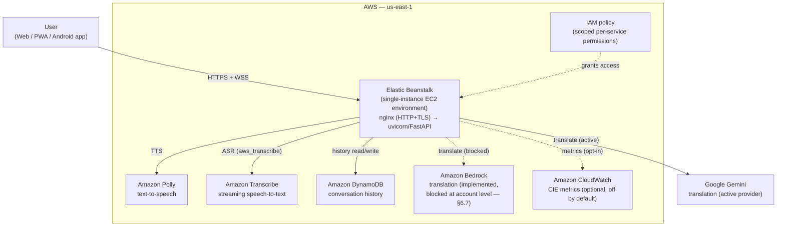

<div align="center">

# VoxBuddy

**Real-Time, Hands-Free AI Speech Translation for Natural Multilingual Conversations - talk, and let your earbuds do the rest.**

*Deployed on AWS - powered by Amazon Polly, Amazon DynamoDB, and Amazon Transcribe.*

</div>

---

## 1. One-line pitch

VoxBuddy listens through your Bluetooth earbuds, figures out who you're actually talking to, translates the conversation live, and speaks the translation back into your ear - no phone screen, no typing, no manual language selection.

---

## 2. Demo links

| Resource | Link |
|---|---|
| 🎥 Demo video | `[ADD LINK]` |
| 📱 Android APK | [VoxBuddy_VoiceAi v1.0.0](https://github.com/Adarsh0414/VoxBuddy_VoiceAI/releases/download/v1.0.0/VoxBuddy_VoiceAi.apk) |
| 🖥️ Backend API (deployed) | [VoxBuddy-CIE_Live_Cockpit](http://voxbuddy-env.eba-ixnm7pmc.us-east-1.elasticbeanstalk.com/?utm_source=chatgpt.com) |

---

## 3. Problem

Language barriers become especially difficult in real-world conversations, where two people need to communicate but don't share a common language - and where stopping to fumble with a phone is slow, awkward, or simply not an option.

> Imagine a patient entering a hospital and speaking a language that the doctor or staff do not understand. Instead of forcing either person to manually select languages, type messages, or repeatedly switch translation modes, VoxBuddy can help bridge the conversation through real-time voice translation.

This isn't just a travel problem, and VoxBuddy isn't just a generic translator app. The same friction shows up anywhere two people need to have a real, spoken conversation across a language gap:

- **Healthcare** - a patient describing symptoms to a doctor or nurse who doesn't speak their language
- **Travel** - asking for directions, haggling at a market, checking into a guesthouse
- **Education** - a student and teacher, or classmates, who don't share a first language
- **Customer service** - a support agent and a customer on a call or at a counter
- **Multilingual communities and cross-language teams** - neighbors, colleagues, or public-service staff who need to communicate day to day

Existing translation apps make you stop the conversation, pull out your phone, hold it up like a walkie-talkie, and hand it back and forth - typing, tapping a language picker, and repeating it for every turn. That breaks eye contact and momentum exactly when it matters most, whether that's a tense moment in a hospital corridor or a fast-moving conversation at a market stall.

The hard part hiding inside that problem isn't translation quality - machine translation is commodity-adjacent in 2026. It's **figuring out who is actually talking to you in the first place.** A live mic in a crowded room picks up the other speaker, a passerby, a third person joining the conversation, and the user's own voice, all mixed together. Naively translating everything produces a stream of garbage and gets it wrong the moment a third party interrupts.

VoxBuddy is a communication tool, not a medical device - in a healthcare setting it helps people talk to each other, and any clinical decision still rests with clinical staff using their own judgment.

---

## 4. Solution

You start a conversation once, then put your phone away. VoxBuddy:

1. **Listens continuously** through your connected earbuds (Bluetooth Classic or BLE)
2. **Figures out who's actually talking to you** - not background noise, not a stranger walking past — using a real signal-fusion engine, not just "loudest voice wins"
3. **Translates what they say in real time**, with rolling conversation context so translations stay coherent turn-to-turn, not isolated sentence-by-sentence guesses
4. **Speaks the translation back into your earbuds** through **Amazon Polly**, in a natural voice, so you never have to look at a screen mid-conversation

---

## 5. ⭐ What makes VoxBuddy different

Most "live translate" demos work great in a silent room with one other speaker. Real conversations aren't like that - there's background noise, other people talking nearby, and the person you're talking to might pause, step away, or hand you off to someone else (a shopkeeper's colleague, a second family member joining in). Most competitors solve none of this; they're a push-to-talk phone screen with a translate button.

VoxBuddy's answer is the **Conversation Intelligence Engine (CIE)** - the one part of the system that is **not** a vendor API call, but original, fully unit-tested logic (`backend/cie/`):

- **Partner identification via signal fusion** - combines voice similarity, turn-taking fit, and semantic coherence rather than trusting any single signal alone
- **Hysteresis** — won't flip who it thinks your "partner" is on one noisy read
- **Bystander rejection** - a stranger's voice nearby doesn't hijack the conversation
- **Multi-partner conversation groups** - tracks up to two active partners at once (a couple, two colleagues), with fast-track/confirmation logic for replacing a member who's gone quiet
- **Self-voice enrollment** - your own voice is registered once at session start and permanently excluded from partner candidacy, so you can never accidentally become "the partner" in your own conversation
- **Incoherence recovery** - self-heals if the conversation state drifts, instead of getting permanently stuck or throwing a visible error

Every other stage (ASR, translation, TTS, storage) sits behind a clean interface, which is what let us build directly on AWS without touching the CIE at all.

---

## 6. ☁️ Built on AWS

VoxBuddy's deployed pipeline runs on AWS:

- **Amazon Bedrock is VoxBuddy's intended default translation provider, fully implemented in code** — see 6.7 for why the *deployed* build currently runs on Gemini instead, and why that's an AWS account-provisioning issue, not a code or architecture gap.
- **Amazon Polly powers VoxBuddy's translated voice output.** Every translated line the user hears is synthesized by Polly, not a third-party TTS vendor.
- **Amazon DynamoDB stores VoxBuddy's conversation history and usage data.** Every saved conversation, day-streak, per-language count, and stats screen reads from and writes to DynamoDB.
- **Amazon Transcribe powers VoxBuddy's real-time speech-to-text.** When `VOXBUDDY_ASR_PROVIDER=aws_transcribe` is set, live microphone audio is streamed straight to Transcribe instead of a third-party ASR vendor.

**Deployed on AWS Elastic Beanstalk** (single-instance EC2 environment, `us-east-1`) - the backend calls out to Amazon Polly, Amazon DynamoDB, and Amazon Transcribe from that instance. See 19 for the full deployment architecture.

### 6.1 Amazon Polly - text-to-speech

**File:** `backend/agents/tts_polly.py`

Calls `boto3.client("polly").synthesize_speech(...)` to turn translated text into spoken audio, streamed back into the user's earbuds. Ships with a language → neural-voice map covering all 15 supported languages, with an automatic fallback to Polly's `standard` engine if a neural voice isn't available in the configured region/account.

**Why Polly:** no separate account or billing relationship beyond AWS, and Polly's voice catalog is fixed and documented rather than account-specific - a stable foundation for a static language→voice map.

### 6.2 Amazon DynamoDB - conversation history

**File:** `backend/persistence_dynamodb.py`

Every conversation, turn, and stats query (`save_conversation`, `list_conversations`, `get_conversation`, `get_summary_stats`, `get_language_breakdown`, `get_day_streak`, `delete_all`) is backed by three DynamoDB tables (conversations, turns, and an atomic-counter table for sequential conversation ids), on-demand billed.

**Why DynamoDB:** a managed, horizontally-scalable store appropriate for a real multi-user deployment, with no server to patch or single-file database to outgrow.

### 6.3 Amazon Transcribe - streaming speech-to-text

**File:** `backend/agents/asr_transcribe.py`

Implements the same `StreamingASRAgent` protocol as the mock and AssemblyAI adapters, using the `amazon-transcribe` (awslabs) async streaming SDK's `start_stream_transcription(...)` call. Selected by setting `VOXBUDDY_ASR_PROVIDER=aws_transcribe`, as a direct alternative to AssemblyAI - same call sites in `session/streaming_manager.py`, zero orchestration changes. Per-word diarization (`Item.speaker`) is resolved to one speaker label per final result via majority vote (`_majority_speaker`).

**Why Transcribe:** no separate account/billing relationship beyond AWS, same as Polly and DynamoDB. **Testing caveat:** unlike Polly and DynamoDB, `moto` does not mock Transcribe's real-time streaming API, so this adapter's automated coverage is limited to the shared `StreamingASRAgent` protocol via `MockStreamingASRAgent` - see `docs/AWS_INTEGRATION.md` for the full caveat before relying on this in production.

### 6.4 Dev-mode fallback

Because every AI/storage stage sits behind a clean interface (`agents/base.py`, `persistence_store.py`), the same codebase can also run entirely offline for local development with **no AWS account and no API keys** - ElevenLabs and SQLite are the zero-config mocks/fallbacks used while developing, selectable with `VOXBUDDY_TTS_PROVIDER` / `VOXBUDDY_PERSISTENCE_PROVIDER`. The **submitted, deployed application runs on Polly, DynamoDB, and (when `VOXBUDDY_ASR_PROVIDER=aws_transcribe`) Transcribe** — see 14 for exactly what's live-tested.

### 6.5 IAM policy

This is the policy actually attached to the deployed IAM user (`voxbuddy-backend-policy`) — Bedrock (see 6.7 for why it's not currently unblocked despite being granted here), Polly, Transcribe, and DynamoDB permissions:

```json
{
    "Version": "2012-10-17",
    "Statement": [
        {
            "Sid": "VoxBuddyBedrockMarketplace",
            "Effect": "Allow",
            "Action": [
                "aws-marketplace:ViewSubscriptions",
                "aws-marketplace:Subscribe",
                "aws-marketplace:Unsubscribe"
            ],
            "Resource": "*"
        },
        {
            "Sid": "VoxBuddyBedrockAvailability",
            "Effect": "Allow",
            "Action": "bedrock:GetFoundationModelAvailability",
            "Resource": "*"
        },
        {
            "Sid": "VoxBuddyBedrockRegionalProfile",
            "Effect": "Allow",
            "Action": "bedrock:InvokeModel",
            "Resource": "arn:aws:bedrock:us-east-1:<YOUR_ACCOUNT_ID>:inference-profile/global.anthropic.claude-sonnet-4-6",
            "Condition": {
                "StringEquals": {
                    "aws:RequestedRegion": "us-east-1"
                }
            }
        },
        {
            "Sid": "VoxBuddyBedrockRegionalModelAccess",
            "Effect": "Allow",
            "Action": "bedrock:InvokeModel",
            "Resource": "arn:aws:bedrock:us-east-1::foundation-model/anthropic.claude-sonnet-4-6",
            "Condition": {
                "StringEquals": {
                    "aws:RequestedRegion": "us-east-1",
                    "bedrock:InferenceProfileArn": "arn:aws:bedrock:us-east-1:<YOUR_ACCOUNT_ID>:inference-profile/global.anthropic.claude-sonnet-4-6"
                }
            }
        },
        {
            "Sid": "VoxBuddyBedrockGlobalModelAccess",
            "Effect": "Allow",
            "Action": "bedrock:InvokeModel",
            "Resource": "arn:aws:bedrock:::foundation-model/anthropic.claude-sonnet-4-6",
            "Condition": {
                "StringEquals": {
                    "aws:RequestedRegion": "unspecified",
                    "bedrock:InferenceProfileArn": "arn:aws:bedrock:us-east-1:<YOUR_ACCOUNT_ID>:inference-profile/global.anthropic.claude-sonnet-4-6"
                }
            }
        },
        {
            "Sid": "VoxBuddyPolly",
            "Effect": "Allow",
            "Action": [
                "polly:SynthesizeSpeech",
                "polly:DescribeVoices"
            ],
            "Resource": "*"
        },
        {
            "Sid": "VoxBuddyTranscribe",
            "Effect": "Allow",
            "Action": [
                "transcribe:StartStreamTranscription",
                "transcribe:StartStreamTranscriptionWebSocket"
            ],
            "Resource": "*"
        },
        {
            "Sid": "VoxBuddyDynamoDBList",
            "Effect": "Allow",
            "Action": [
                "dynamodb:ListTables"
            ],
            "Resource": "*"
        },
        {
            "Sid": "VoxBuddyDynamoDBTables",
            "Effect": "Allow",
            "Action": [
                "dynamodb:CreateTable",
                "dynamodb:DescribeTable",
                "dynamodb:GetItem",
                "dynamodb:PutItem",
                "dynamodb:UpdateItem",
                "dynamodb:DeleteItem",
                "dynamodb:Query",
                "dynamodb:Scan"
            ],
            "Resource": "arn:aws:dynamodb:us-east-1:<YOUR_ACCOUNT_ID>:table/voxbuddy_*"
        }
    ]
}
```

`polly:SynthesizeSpeech`/`DescribeVoices` and `transcribe:StartStreamTranscription*` have no resource-level restriction in AWS (neither service supports resource ARNs for these actions, so `Resource: "*"` is the tightest scope available). `dynamodb:ListTables` is also account/region-scoped by AWS, not per-table - it's used once at startup (`persistence_dynamodb.init_db()`) to check which tables already exist. Every other DynamoDB action is scoped to `voxbuddy_*`-prefixed tables and limited to exactly the operations the code calls (no `dynamodb:*` wildcard) - this policy grants nothing beyond what `backend/persistence_dynamodb.py` actually uses.

The Bedrock statements target Claude Sonnet 4.6 specifically via its **inference profile ARN** (`global.anthropic.claude-sonnet-4-6`), not the bare foundation-model ARN - this model requires cross-region inference, so `bedrock:InvokeModel` needs both the profile-scoped statement and the two foundation-model statements with a matching `bedrock:InferenceProfileArn` condition (one for `us-east-1`, one for AWS's "unspecified"/global routing) to actually authorize a call. `VoxBuddyBedrockAvailability` and `VoxBuddyBedrockMarketplace` are what's needed to check and subscribe to the model in the first place - per 6.7, having these correct in IAM turned out to be necessary but not sufficient; the block that's actually stopping calls sits on AWS's Marketplace/billing side, not here.

**Important:** every `<YOUR_ACCOUNT_ID>` placeholder above (four of them — three in the Bedrock inference-profile ARNs, one in the DynamoDB table ARN) must be your actual AWS account ID - a blank account-ID segment (`us-east-1::...`) does not default to "your account" the way it does for a few AWS-owned global resources, and won't match any real resource ARN. Double-check the **JSON** tab on the live policy in the IAM console and fix any empty segment there - the repo doesn't store the live policy, only this reference copy.

This policy does **not** grant `cloudwatch:PutMetricData` or any `s3:*` actions - if you turn on `VOXBUDDY_CLOUDWATCH_METRICS` or `VOXBUDDY_CALIBRATION_LOGGING` (both off by default; see `docs/AWS_INTEGRATION.md`), add the extra statements shown there first, or those calls will fail with `AccessDenied`.

### 6.6 AWS reference

| Resource | Value |
|---|---|
| AWS Region | `us-east-1` |
| Deployment platform | AWS Elastic Beanstalk (single-instance EC2 environment) - see 19 |
| AWS Services used (pipeline) | Amazon Bedrock (implemented, not yet reachable - 6.7), Amazon Polly, Amazon DynamoDB, Amazon Transcribe |
| AWS Services used (optional, off by default) | Amazon CloudWatch, Amazon S3 - see `docs/AWS_INTEGRATION.md` 4–5 |
| DynamoDB Tables | `voxbuddy_conversations`, `voxbuddy_turns`, `voxbuddy_counters` (prefix via `DYNAMODB_TABLE_PREFIX`) |
| Architecture diagram (AWS-focused) | See 19.5 (Mermaid diagram, rendered inline in this README) |

See `docs/AWS_INTEGRATION.md` for the full write-up, including how a real `moto`-backed test run against Polly's voice catalog caught a real bug before production (the French voice was mapped to `"Lea"` instead of Polly's actual voice id `"Léa"`).

### 6.7 Amazon Bedrock - translation (implemented, blocked at the AWS account level; Gemini is the active provider in the deployed build)

**File:** `backend/agents/translation_bedrock.py`

Fully implements the same `TranslationAgent` protocol (`agents/base.py`) as the Anthropic and Gemini adapters, using the Bedrock Runtime **Converse API** (`boto3.client("bedrock-runtime").converse(...)`) rather than `invoke_model`, so switching `BEDROCK_MODEL_ID` to a different model family needs no code change here. Selectable via `VOXBUDDY_TRANSLATION_PROVIDER=bedrock`, using the same `AWS_ACCESS_KEY_ID` / `AWS_SECRET_ACCESS_KEY` / `AWS_REGION` credentials as Polly and DynamoDB above - no separate key required, and the IAM policy for it (`bedrock:InvokeModel` scoped to the `BEDROCK_MODEL_ID` resource ARN, plus the `aws-marketplace:ViewSubscriptions` / `Subscribe` / `Unsubscribe` actions AWS requires for third-party Bedrock models) is written and ready in `docs/AWS_INTEGRATION.md`.

**Why the deployed app doesn't actually call Bedrock right now:** every call fails with `AccessDeniedException`, tracing back to AWS Marketplace, not to this codebase or its IAM policy. Subscribing to "Claude Sonnet 4.6 (Amazon Bedrock Edition)" (Product ID `prod-ffvjxvh4ltq64`) on our AWS account repeatedly auto-terminates the subscription agreement — service start and service end land on the *same timestamp*, every time, across five separate attempts (agreement IDs `agmt-26ke1lcobnbghjv2ax3qnnulj`, `agmt-2faci7i6mh8m4uu86kuv4iuvh`, `agmt-36zc6irds3x60xq0h5sb8qfwr`, and others) - after fixing every documented, console-visible cause in order:

1. Initial error: `AccessDeniedException ... IAM user or service role is not authorized to perform the required AWS Marketplace actions (aws-marketplace:ViewSubscriptions, aws-marketplace:Subscribe)` → added those actions to the IAM policy. No change.
2. Next error, testing directly in the Bedrock console Playground (ruling out our own IAM user entirely): `AccessDeniedException: ... INVALID_PAYMENT_INSTRUMENT: A valid payment instrument must be provided` → the AWS account had **zero payment methods on file** (confirmed on the Billing → Payment methods page). Added UPI AutoPay first — didn't resolve it, since AWS's own UI separately flagged *"Your AWS account is not verified. Add a valid credit card to verify the account"*, i.e. UPI alone doesn't satisfy Marketplace's account-verification requirement. Added a RuPay debit card on top of UPI specifically to clear that verification step; the "not verified" warning did go away once the card was added.
3. After all of the above — IAM permissions fixed, UPI AutoPay *and* a verified RuPay card both on file, account verification cleared — resubscribing via **AWS Marketplace → Discover products → Claude Sonnet 4.6 (Amazon Bedrock Edition) → Subscribe** still produces the identical same-timestamp terminate, with no error reason surfaced anywhere in the console — not on the subscription confirmation, not on the agreement detail page, not in the follow-up email. So the account-verification fix cleared its own warning but didn't unblock the actual subscription, which points to something on AWS's backend beyond what any console page surfaces.

This account also has a live, AWS-confirmed $100 hackathon credit (WeMakeDevs, credit ID `10067457025`, explicitly covering Amazon Bedrock / Amazon Bedrock Service / AmazonBedrockFoundationModels per its service list) — so this isn't a spend-limit or billing-eligibility problem either. At this point the cause is only visible from AWS's side, and it's filed as an **AWS Support case** (Billing/Marketplace category) rather than something fixable from the console. If it resolves, flipping `VOXBUDDY_TRANSLATION_PROVIDER` from `gemini` back to `bedrock` is the only change needed — the adapter, IAM policy, and credentials are already in place and untouched.

**What the deployed app actually runs on instead:** `VOXBUDDY_TRANSLATION_PROVIDER=gemini` with a personal `GEMINI_API_KEY` — the same Gemini integration that was VoxBuddy's original, real-device-tested translation path before the Bedrock adapter was added. Nothing about the CIE, ASR, TTS, or persistence layers changed to make this work — the provider abstraction in `agents/base.py` is exactly what made this a one-line config swap instead of a rewrite.

**IAM:** the `bedrock:InvokeModel` + `aws-marketplace:*` statements are included in the live `voxbuddy-backend-policy`, ahead of §6.5's policy actually working end-to-end — they're necessary but, per the above, not sufficient on their own.

---

## 7. 🏗️ Architecture

```
┌─────────────┐        WebSocket (audio)         ┌──────────────────────────┐
│   Mobile /   │ ───────────────────────────────▶ │        FastAPI            │
│  Web client  │                                   │                            │
│  (earbuds    │ ◀─────────────────────────────── │  /ws/{session}/audio      │
│   mic + TTS  │        translated audio           │        │                   │
│   playback)  │                                   │        ▼                   │
└─────────────┘                                   │  Streaming ASR Agent       │
                                                    │  (Transcribe, active)      │
                                                    │        │ final transcript  │
                                                    │        ▼                   │
                                                    │  Conversation              │
                                                    │  Intelligence Engine (CIE) │
                                                    │  — partner? bystander?     │
                                                    │        │ accepted turn     │
                                                    │        ▼                   │
                                                    │  Translation Agent         │
                                                    │  (Gemini, active; Bedrock  │
                                                    │   implemented, blocked —   │
                                                    │   see §6.7)                │
                                                    │        │ translated text   │
                                                    │        ▼                   │
                                                    │  Amazon Polly              │
                                                    │  (text-to-speech)          │
                                                    │        │ audio bytes       │
                                                    │        ▼                   │
                                                    │  Amazon DynamoDB           │
                                                    │  (conversation history)    │
                                                    └──────────────────────────┘
```

Every stage in the middle column sits behind a small interface (`agents/base.py`), which is what makes the AWS integration a real architectural choice rather than a hardcoded dependency - Polly and DynamoDB are what the deployed app runs on; a local, offline mock/fallback path exists purely for development (see 6.4). The ASR stage itself is swappable via `VOXBUDDY_ASR_PROVIDER` — `mock` (default, no network), `assemblyai`, or `aws_transcribe` (the AWS-native option, `backend/agents/asr_transcribe.py`) — all three implement the same `StreamingASRAgent` protocol, so this diagram's ASR box is whichever one is configured, not a fixed dependency.

### 7.1 Supported languages

VoxBuddy's translation stage is LLM-based (Amazon Bedrock by default, with Anthropic Claude or Google Gemini as optional alternatives) and not limited to a fixed list — but the Polly voice map currently covers **15 languages** out of the box:

`English` · `Spanish` · `French` · `German` · `Italian` · `Portuguese` · `Hindi` · `Japanese` · `Korean` · `Chinese (Mandarin)` · `Arabic` · `Russian` · `Dutch` · `Polish` · `Turkish`

Adding another language is a one-line addition to `VOICE_MAP` in `backend/agents/tts_polly.py`; any language outside the map still gets a translation, just with a default-voice TTS fallback.

---

## 8. Key features

**Real-time pipeline**
- Live microphone capture → streaming ASR → context-aware translation → Polly TTS playback, end to end
- Adaptive voice-activity gating (skips forwarding silence/ambient noise, not full noise cancellation)
- WebSocket auto-reconnect with exponential backoff - a dropped connection resumes the *same* conversation state instead of restarting

**Authentication**
- Passwordless OTP login via email or phone (hashed codes, single-use, rate-limited, auto-expiring)
- Google Sign-In as an alternative, verified server-side against Google's own public keys
- Bearer-token sessions, optionally backed by Redis for horizontal scaling

**Conversation history & stats (DynamoDB)**
- Every conversation is persisted to DynamoDB and scoped to the logged-in user
- Real day-streak, per-language conversation counts, and total talk time - computed from actual history, not placeholder numbers

**Mobile app**
- Installable PWA (manifest + service worker, real home-screen icon, full-screen launch)
- Native Android app (Capacitor) with a foreground service to keep listening alive when backgrounded, native Bluetooth audio device detection, and adaptive launcher icons
- iOS project scaffolded (Xcode project generated; full native build requires macOS)

**Interface-driven pipeline**
- Every AI stage (ASR, translation, TTS, persistence) sits behind a clean interface with a real vendor adapter and a working local mock, swappable purely via environment variables — this is *why* plugging in Polly and DynamoDB required no orchestration changes

---

## 9. 🚀 WeMakeDevs × AWS First Commit 2026

VoxBuddy was built and submitted as part of **First Commit**, a hackathon run by **WeMakeDevs** in partnership with **AWS**, as part of the **Bharat Builds Tour**. First Commit ran **September 17–20, 2026**, in teams of 1–4, hybrid — online across India, with an optional in-person hack day in Bangalore on September 19, 2026.

| | |
|---|---|
| First commit | `bcd76ce` — "Initial commit" |
| Date | 2026-09-18 |
| What it established | Initial FastAPI backend skeleton, mock agent interfaces (ASR/translation/TTS), the CIE scaffold, and the project's frontend/PRD baseline |
| Event page | [wemakedevs.org/aws/first-commit](https://www.wemakedevs.org/aws/first-commit) |

**Why VoxBuddy fits "Ship It":** the event's AWS track rewards projects that are actually deployed on AWS, not just prototyped. VoxBuddy's backend runs on **AWS Elastic Beanstalk**, its text-to-speech runs on **Amazon Polly**, its conversation history runs on **Amazon DynamoDB**, and its live speech-to-text runs on **Amazon Transcribe** - all four are genuinely in the request path of the deployed app, not a demo-only integration. See 19 for the full deployment writeup.

---

## 10. Cost considerations

Cloud AI inference cost is treated as a first-class product metric, not an afterthought:

- **Amazon Polly** bills per character synthesized, with no separate account/subscription needed beyond AWS - no dedicated TTS vendor bill to manage.
- **Amazon DynamoDB** runs on-demand (`PAY_PER_REQUEST`) billing, so cost scales with actual usage - near-zero at hackathon/demo traffic, with no fixed server cost and no single-instance ceiling to hit as usage grows.
- **ASR and translation are the more expensive stages** (streaming ASR is billed per audio-hour; LLM-based translation is billed per token) - the vendor research in `docs/vendor_decision.md` tracks cost-per-minute for every ASR/TTS vendor considered, and the PRD (`docs/VoxBuddy_PRD_and_Architecture.md`, 6) lists "cloud AI inference cost per conversation-minute" as a tracked non-functional requirement.
- **Testing costs nothing:** both AWS integrations are tested against `moto`, so CI and local test runs never touch billed AWS endpoints.

---

## 11. Testing

```bash
cd backend
pytest tests/ -v
```

**276 tests** (270 passing, 6 skipped as of the last verified run) across 26 test files, covering the CIE's partner-identification logic, streaming pipeline wiring, auth (OTP + Google Sign-In), persistence, TTS/ASR error handling, session token storage, and every AWS integration. Notably:

- `test_tts_polly.py` - 4 tests: real audio bytes returned, every mapped language synthesizes, unmapped languages fall back correctly, and the neural→standard engine fallback actually triggers.
- `test_persistence_dynamodb.py` - 7 tests: save/retrieve, empty-session handling, user-scoped listing, id sequencing, delete-all, ownership lookup, and stats/language-breakdown aggregation - mirroring every scenario the local-dev test suite already covers, so the DynamoDB backend is proven to satisfy the same contract `app.py` depends on.
- `test_translation_bedrock.py`, `test_cie_cloudwatch_metrics.py`, `test_cie_calibration.py`, `test_cie_calibration_log.py` — cover the Bedrock translation adapter, CloudWatch metrics publishing, and the opt-in S3 calibration-logging flywheel (see `docs/AWS_INTEGRATION.md`).

Every AWS-backed test file uses [`moto`](https://github.com/getmoto/moto) (AWS's official mocking library) or a mocked client — no real AWS calls, no cost, and no credentials needed to run the suite. The 6 skips are environment-conditional cases (e.g. optional-dependency paths), not failures.

---
---

*Everything below this line goes deeper: exact user flow, full tech stack, AWS-specific design decisions, what's real vs. mocked, implementation notes, project layout, and how to run it locally.*

---

## 12. 🔄 User flow

1. Open the app once, sign in (OTP or Google), set a default spoken language, and connect Bluetooth earbuds - this is the *only* manual step in the entire experience.
2. Put the phone away and start talking. VoxBuddy's earbud mic captures your speech and streams it over a WebSocket to the backend.
3. Streaming ASR turns speech into text in near real time.
4. The **CIE** decides, per utterance: is this you, your conversation partner, or a bystander who should be ignored? It holds that decision with hysteresis so it doesn't flip on a single noisy read.
5. Accepted turns go to the context-aware translation agent, which uses the rolling conversation history so translations stay coherent turn-to-turn.
6. The translated text is synthesized into speech by **Amazon Polly** and streamed back into your earbuds - no screen, no typing, no manual language picker.
7. If your conversation partner changes (you turn to a new person, or a second person joins), the CIE detects it and re-establishes the partner automatically.
8. The finished conversation is persisted to **Amazon DynamoDB** (opt-in history) so your streaks, per-language counts, and total talk time are computed from real usage.

---

## 13. Tech stack

| Layer | Technology |
|---|---|
| Backend | Python, FastAPI, WebSockets, asynchronous request/audio handling |
| Audio format | 16 kHz PCM streamed over WebSocket |
| **Speech-to-text (deployed)** | **Amazon Transcribe** streaming (`VOXBUDDY_ASR_PROVIDER=aws_transcribe`); [AssemblyAI](https://www.assemblyai.com/) streaming API available as an alternative (`assemblyai`) |
| **Translation (deployed)** | **Google Gemini** (`VOXBUDDY_TRANSLATION_PROVIDER=gemini`) - context-aware; [Amazon Bedrock](https://aws.amazon.com/bedrock/) is the code default and fully implemented but currently blocked at the AWS account level (see 6.7); [Anthropic Claude](https://www.anthropic.com/) is a third optional provider |
| **Text-to-speech (deployed)** | **Amazon Polly** |
| **Conversation history (deployed)** | **Amazon DynamoDB** |
| Local dev fallback | ElevenLabs (TTS) and SQLite (history) - used only for offline/no-AWS-account development, see §6.4 |
| Auth | Custom OTP (SMTP or Brevo for email, Fast2SMS or Brevo for SMS) + Google Sign-In (verified server-side against Google's public keys) |
| Session storage | SQLite (default) or Redis (optional, for scaling auth tokens) |
| Frontend | Vanilla JS single-page app, PWA (manifest + service worker) |
| Mobile shell | [Capacitor](https://capacitorjs.com/) - real Android Studio/Gradle project + Xcode project |
| **Deployment (live)** | **AWS Elastic Beanstalk** (single-instance EC2 environment, see §19) |
| Deployment (alternative) | [Render](https://render.com/) (`render.yaml` blueprint included, not the currently live deployment) |
| Testing | pytest — 276 backend tests (270 passing, 6 skipped) |

---

## 14. AWS design decisions

Design choices made specifically because AWS is the deployed platform, not just "which vendor is cheapest":

- **Interface-first, AWS by default.** Polly and DynamoDB sit behind interfaces (`TTSAgent`, `persistence_store`) that also support a local mock/fallback - but production configuration (`VOXBUDDY_TTS_PROVIDER=polly`, `VOXBUDDY_PERSISTENCE_PROVIDER=dynamodb`) requires zero changes to `session/manager.py` or `app.py`'s route handlers.
- **One shared credential set.** Both integrations read the same `AWS_ACCESS_KEY_ID` / `AWS_SECRET_ACCESS_KEY` / `AWS_REGION` environment variables via `boto3`'s default credential chain - no VoxBuddy-specific AWS config layer to maintain.
- **Neural-first, standard-fallback for Polly.** Neural voices sound materially better but aren't guaranteed available for every language/region/account combination, so `tts_polly.py` always attempts `neural` first and falls back to `standard` on rejection.
- **Three-table DynamoDB schema, not one.** Conversations, turns, and an atomic-counter table are kept separate so conversation ids can increment atomically (`dynamodb:UpdateItem` with `ADD`) without a read-modify-write race, and so per-turn data doesn't bloat the conversation-list query.
- **`persistence_store.py` swaps the whole module, not individual functions.** A partial re-export would break tests that monkeypatch module-level globals like `persistence.DB_PATH`; replacing the entry in `sys.modules` keeps the DynamoDB and local-dev backends behaviorally identical from every caller's point of view.
- **Scoped IAM, not a wildcard.** The policy in 6.5 grants exactly the DynamoDB operations `persistence_dynamodb.py` calls, scoped to `voxbuddy_*`-prefixed tables - no `dynamodb:*`.
- **`moto` over live AWS calls in tests.** Every AWS code path is exercised in CI without real credentials, real cost, or real network calls.

---

## 15. What's real vs. what's a mock

The **deployed application uses real Amazon Polly, real Amazon DynamoDB, and real Amazon Transcribe** - all are complete implementations against AWS's documented APIs, not stubs. Amazon Bedrock (translation) is also a complete implementation but is currently not the active provider in the deployed build — see 6.7. For local development without an AWS account, the same interfaces fall back to ElevenLabs/SQLite/mocked ASR, so the app is easy to run and demo offline too.

---

## 16. Technical implementation

- **Interface-driven, not vendor-driven.** Every AI stage is a small `Protocol`/interface (`agents/base.py` for ASR/translation/TTS, `persistence_store.py` for storage) with one method contract, a mock implementation, and one or more real adapters. Adding a new vendor for any stage is a new adapter file plus one `if provider == "..."` branch in `agents/factory.py` - never a change to the orchestration logic in `session/manager.py`.
- **The CIE is a pure state machine, not a wrapper around an LLM.** It consumes structured signals (voice similarity, turn-taking pattern, semantic coherence) and maintains a per-session `Conversation State Graph` - speakers, active partners, turn history, rolling topic context - independently of which ASR/translation/TTS vendor is plugged in underneath it.
- **Streaming end to end.** Audio flows over a WebSocket in real time; a `StreamingASRAgent` interface (event-callback shaped, matching how real vendor SDKs actually work) bridges into the same CIE + translation + TTS pipeline used by the batch/mock path, so streaming and non-streaming code share one contract, verified in `test_streaming_session.py`.
- **Self-healing over hard failure.** The Polly adapter retries with a safe fallback (the `standard` engine) rather than raising to the caller when a vendor rejects a specific voice/engine combination - the same self-healing philosophy the CIE applies to misattributed conversation partners.
- **Persistence is swappable without touching route handlers.** `app.py` imports `persistence_store`, which replaces its own entry in `sys.modules` with whichever backend is selected - so `VOXBUDDY_PERSISTENCE_PROVIDER=dynamodb` changes the entire storage layer with no changes to any FastAPI route.

---

## 17. Project structure

```
voxbuddy/
├── backend/
│   ├── app.py                    FastAPI app — REST + WebSocket API
│   ├── cie/                      Conversation Intelligence Engine (real, original logic)
│   ├── agents/                   ASR / Translation / TTS interfaces, mocks, and real vendor adapters
│   │   └── tts_polly.py          Text-to-speech — Amazon Polly adapter (deployed default)
│   ├── session/                  Per-session pipeline orchestration + streaming bridge
│   ├── auth_store.py             OTP auth, users, sessions
│   ├── otp_providers.py          SMTP / Brevo / Fast2SMS OTP delivery
│   ├── persistence.py            Conversation history (SQLite, local-dev fallback)
│   ├── persistence_dynamodb.py   Conversation history — Amazon DynamoDB adapter (deployed default)
│   ├── persistence_store.py      Persistence backend selector (env-var driven)
│   ├── token_store.py            Session tokens (SQLite or Redis)
│   └── tests/                    276 pytest tests, incl. moto-based AWS tests
├── frontend/
│   ├── app-preview.html          ⭐ Current product UI, served at /app — Login, Home, Conversation, History, Settings, plus a pre-login Interactive CIE Demo off the login screen...
│   ├── product-preview.html      (Early UI prototype/wireframe — historical reference only, superseded by app-preview.html; not linked from the running app)
│   ├── index.html                CIE developer/testing dashboard
│   ├── manifest.json / sw.js     PWA install + service worker
│   └── privacy.html, terms.html  Legal pages
├── mobile/
│   ├── android/                  Real Android Studio/Gradle project (Capacitor)
│   │   └── .../AudioDevicePlugin.java, ConversationForegroundService.java   Native plugins
│   └── ios/                      Xcode project (Capacitor) — build requires macOS
├── docs/
│   ├── VoxBuddy_PRD_and_Architecture.md
│   ├── AWS_INTEGRATION.md        Full write-up of the Bedrock/Polly/DynamoDB/Transcribe/CloudWatch/S3 integrations
│   ├── AWS_DEPLOYMENT.md         Elastic Beanstalk deployment architecture & process
│   ├── vendor_decision.md
│   ├── MOBILE_BUILD.md
│   ├── PLAY_STORE_PUBLISHING.md
│   └── TESTING_REAL_PIPELINE.md
├── .ebextensions/                 Elastic Beanstalk config (HTTPS security group, certbot install)
├── .platform/hooks/postdeploy/    EB deploy hook — provisions Let's Encrypt TLS on the instance
├── Procfile                       EB/Foreman-style process declaration (`web: uvicorn ...`)
├── requirements.txt               Root pointer to backend/requirements.txt (EB's Python platform reads this)
└── render.yaml                    Render deployment blueprint (alternative platform, not the live deployment)
```

---

## 18. Getting started

### Backend

```bash
cd backend
python -m venv .venv
source .venv/bin/activate        # Windows: .venv\Scripts\activate
pip install -r requirements.txt
uvicorn app:app --reload
```

Open **http://127.0.0.1:8000/app** - this is the current VoxBuddy product UI (`frontend/app-preview.html`). Without AWS credentials set, every stage runs in local mock/fallback mode (no keys needed) so the whole flow - login, conversation, history - still works out of the box for development.

> Note: the repo also contains `frontend/product-preview.html` (served at `/preview`). This is an early UI prototype/wireframe kept for historical reference only - it is not the product and should be ignored when evaluating VoxBuddy. `/app` is the one and only current product experience.

> 🎬 **Judges in a hurry:** on the `/app` login screen, tap **"See How VoxBuddy Works"** for a pre-login Interactive Demo - no account, OTP, or microphone permission needed. It walks through 5 scripted scenarios (conversation partner, bystander filtering, self-voice exclusion, multiple partners, noisy-environment adaptation) using real output from the Conversation Intelligence Engine (`backend/cie/engine.py`), computed offline so it works with zero network/vendor dependencies. It's a fixed, deterministic walkthrough for a fast "what makes this different" pitch - not a substitute for the real logged-in conversation flow above.

### Running on AWS (Polly + DynamoDB + Transcribe)

Copy `.env.example` to `.env` in `backend/` and set:

```bash
VOXBUDDY_TTS_PROVIDER=polly
VOXBUDDY_PERSISTENCE_PROVIDER=dynamodb
VOXBUDDY_ASR_PROVIDER=aws_transcribe
AWS_ACCESS_KEY_ID=...
AWS_SECRET_ACCESS_KEY=...
AWS_REGION=us-east-1
DYNAMODB_TABLE_PREFIX=voxbuddy
```

This is the configuration the deployed app runs with. The IAM user needs the policy in §6.5 — note that policy must include `transcribe:StartStreamTranscription` for the ASR leg, in addition to the Polly/DynamoDB permissions. DynamoDB's three tables are created automatically on startup; there's no separate table-creation step.

### Other providers

| Stage | Env vars | Notes |
|---|---|---|
| Translation (Gemini is what the deployed app actually runs — see 6.7 for why) | `VOXBUDDY_TRANSLATION_PROVIDER=gemini\|anthropic\|bedrock` + matching API key/credentials | `gemini` is the active provider; `bedrock` is implemented and ready but blocked at the AWS account level (6.7); `anthropic` is a third option, bring your own API key |
| Speech-to-text (alternative to AWS Transcribe above) | `VOXBUDDY_ASR_PROVIDER=assemblyai` + `ASSEMBLYAI_API_KEY` | Real mic transcription |
| Text-to-speech (local dev only) | `VOXBUDDY_TTS_PROVIDER=elevenlabs` + `ELEVENLABS_API_KEY` | Needs real voice IDs in `agents/tts_elevenlabs.py` |
| Conversation history (local dev only) | `VOXBUDDY_PERSISTENCE_PROVIDER=sqlite` | Zero-config, no AWS account needed |
| OTP email | `VOXBUDDY_OTP_EMAIL_PROVIDER=smtp\|brevo` + credentials | Falls back to console-printed codes if unset |
| OTP SMS | `VOXBUDDY_OTP_SMS_PROVIDER=fast2sms\|brevo` + credentials | Optional |
| Google Sign-In | `GOOGLE_CLIENT_ID` (+ `GOOGLE_CLIENT_SECRET` for native) | Sign-in button hides itself if unset |
| Redis sessions | `VOXBUDDY_SESSION_STORE=redis` + `REDIS_URL` | Optional |
| Audio WebSocket idle/session timeout | `VOXBUDDY_WS_IDLE_TIMEOUT_SECONDS` (default 100) / `VOXBUDDY_WS_MAX_SESSION_SECONDS` (default 1800) | Auto-closes `/ws/{session_id}/audio` if left open idle or too long, so a forgotten/backgrounded connection can't bill a real-time ASR vendor indefinitely — see `websocket_audio_session()` in `app.py` |

### Testing on your phone over WiFi

```bash
uvicorn app:app --host 0.0.0.0 --reload
```

Then open `http://<your-pc-local-ip>:8000/app` from your phone on the same network. Install it to your home screen (Chrome: menu → "Install app"; Safari: Share → "Add to Home Screen") for a full-screen, native-feeling launch.

### Native Android / iOS

`mobile/` is a real Capacitor project - an actual Android Studio/Gradle project and an actual Xcode project, both pointed at your deployed backend URL (`mobile/capacitor.config.ts`). See `docs/MOBILE_BUILD.md` for the full build guide. iOS specifically requires building on macOS with Xcode - there's no way around that platform requirement.

### Deploying

The **live deployment runs on AWS Elastic Beanstalk** - see 19 for the full architecture and deployment process. In short: the repo's root `Procfile` (`web: uvicorn --app-dir backend app:app --host 0.0.0.0 --port 8000`) and root `requirements.txt` (which just points at `backend/requirements.txt`) are what EB's Python platform reads to build and run the app as a single-instance EC2 environment; `.ebextensions/` and `.platform/hooks/postdeploy/` handle the HTTPS security-group rule and Let's Encrypt certificate provisioning.

`render.yaml` is also included as a ready-to-use [Render](https://render.com/) blueprint (connect the repo, set your vendor API keys in Render's dashboard, and it deploys as one FastAPI service) - it works, but it is **not** the platform the currently live deployment runs on; treat it as an alternative/backup deployment path.

---

## 19. ☁️ AWS Architecture & Deployment (Elastic Beanstalk)

This section documents exactly where the backend runs on AWS and how requests reach it. See also `docs/AWS_DEPLOYMENT.md` for a standalone version of this write-up, and 6 for what each AWS service does inside the application.

### 19.1 Where the backend is deployed

The FastAPI backend is deployed to **AWS Elastic Beanstalk** as a **single-instance environment** (no load balancer) running on EB's Python platform, on top of a single **EC2** instance:

- **Procfile** (`web: uvicorn --app-dir backend app:app --host 0.0.0.0 --port 8000`) tells EB how to start the app.
- **Root `requirements.txt`** is a one-line pointer (`-r backend/requirements.txt`) so EB's Python platform installs the exact same dependency set used locally, from a single source of truth.
- **`.ebextensions/00_install_certbot.config`** installs `certbot`/`certbot-nginx` into an isolated virtualenv on the instance at deploy time.
- **`.ebextensions/10_open_https_port.config`** adds an inbound rule for port 443 to the environment's security group (EB opens port 80 by default; a single-instance environment has no ELB/ALB in front of it to terminate TLS, so the instance has to do it itself).
- **`.platform/hooks/postdeploy/00_get_certificate.sh`** runs after every deploy: it requests/renews a free Let's Encrypt certificate via the `webroot` method (so it never needs to guess at EB's managed nginx `server_name` config) and writes a hand-built `server { listen 443 ssl; ... }` nginx block that proxies to the same upstream EB's own HTTP block uses - including the `Upgrade`/`Connection` headers the app's `/ws/*` WebSocket endpoints need. This only activates if the `VOXBUDDY_HTTPS_DOMAIN` and `VOXBUDDY_HTTPS_EMAIL` environment properties are set on the environment; otherwise it's a no-op.

### 19.2 How requests and WebSocket traffic reach the backend

Clients (the web frontend, the PWA, and the native Android app) talk to the single EC2 instance's public `*.elasticbeanstalk.com` hostname (or a custom domain pointed at it) over HTTPS. EB's own nginx reverse-proxies plain HTTP traffic to the uvicorn process on port 8000; the hand-written 443 block from the certbot hook does the same over TLS, forwarding WebSocket upgrade headers so `/ws/{session_id}` and `/ws/{session_id}/audio` work identically over `wss://` as they do locally over `ws://`.

### 19.3 IAM

A dedicated IAM user (`voxbuddy-backend-policy` is the policy name, not a user name - see 6.5 for the full JSON) grants the deployed application exactly the permissions its AWS SDK calls need: `polly:SynthesizeSpeech`/`DescribeVoices`, `transcribe:StartStreamTranscription*`, a scoped set of `dynamodb:*` actions limited to `voxbuddy_*`-prefixed tables, and the Bedrock/AWS Marketplace actions needed for the (currently blocked, see 6.7) Bedrock translation path. Credentials are supplied to the running instance as environment variables (`AWS_ACCESS_KEY_ID` / `AWS_SECRET_ACCESS_KEY` / `AWS_REGION`), read automatically by `boto3`'s default credential chain - there is no separate VoxBuddy-specific AWS configuration layer. No AWS account IDs, access keys, or secret values are published in this repository or its documentation.

### 19.4 Monitoring / logging

Amazon CloudWatch integration exists in the codebase (`backend/cie/cloudwatch_metrics.py`) for publishing the CIE's own decision metrics (confidence, latency, bystander-rejection rate, partner-switch rate) to the `VoxBuddy/CIE` namespace, but it is **off by default** (`VOXBUDDY_CLOUDWATCH_METRICS=false`) and is not confirmed enabled on the current live deployment. EB itself also provides basic instance/environment health monitoring (CPU, latency, environment health) through its own console, independent of anything in the application code.

### 19.5 Architecture diagram



The FastAPI process itself runs the full pipeline in-process: WebSocket audio in → streaming ASR (Transcribe) → Conversation Intelligence Engine → translation (Gemini, with Bedrock wired in but not currently reachable) → Amazon Polly → audio back to the client, with each completed conversation written to DynamoDB.

---

## 20. Security

- **Secrets via environment variables only.** All API keys and AWS credentials are read from environment variables (`backend/.env` locally, EB environment properties in production) - never hardcoded, and `.env` is listed in `.gitignore` and confirmed to have no history in the repo's git log.
- **Authentication.** Passwordless OTP (email/phone) with hashed, single-use, rate-limited, auto-expiring codes, using constant-time comparison (`hmac.compare_digest`) to avoid timing attacks; Google Sign-In is verified server-side against Google's own public keys rather than trusted client-side. A per-IP rate limit (8 requests / 10 minutes) additionally caps OTP-request spam across different identifiers.
- **AWS IAM least privilege.** The deployed IAM policy (6.5) grants only the specific actions each integration calls — scoped DynamoDB actions limited to `voxbuddy_*`-prefixed table ARNs, no `dynamodb:*` wildcard, and no `s3:*` or `cloudwatch:PutMetricData` grants unless those optional features are explicitly turned on.
- **Same-origin by default.** No `CORSMiddleware` is configured, since the frontend and backend are served from the same origin — this means the browser's default same-origin policy applies, and a page on another domain cannot make authenticated requests against the API.
- **Known, documented tradeoff — auth tokens in `localStorage`.** Session tokens are stored in browser `localStorage` rather than an httpOnly cookie, which means a successful XSS could read a token directly. This is a deliberate, documented decision (not an oversight) because the app runs both in a normal browser tab and inside a Capacitor native WebView pointed at a remote origin, and cookie-based auth across both needs its own dedicated pass. 
- **`.gitignore` coverage.** `.env`, the local SQLite database file, build artifacts, and mobile signing files (`*.keystore`, `*.jks`) are all excluded from version control.
- **This documentation does not publish** IAM secret access keys, AWS account IDs, OAuth client secrets, or any other production credential — every code sample uses placeholders (e.g. `<YOUR_ACCOUNT_ID>`, `your_key_here`).

---

## 21. Real-world impact

### Healthcare example

A patient may arrive at a hospital speaking a language that the doctor or nursing staff cannot understand. Instead of stopping to type messages, hand a phone back and forth, or call for an interpreter and wait, VoxBuddy can help facilitate the spoken conversation in real time, letting each person speak and be understood in their own language. VoxBuddy is a communication tool, not a diagnostic or clinical-decision system - it helps people talk to each other; clinical judgment stays with clinical staff.

### Other scenarios

- **Travelers and locals** - asking for directions, negotiating a price, or checking into a place to stay without a shared language.
- **International students** - following a classroom conversation or talking with classmates and instructors who speak a different first language.
- **Multilingual customer support** - a support agent and a customer communicating naturally instead of routing through a scripted translation tool.
- **Public-service interactions** - a resident and a public-service worker (e.g. at a government office or help desk) who don't share a language.
- **Cross-language teams** - colleagues who default to different first languages having a real, spoken working conversation.

---

## 22. Future Scope: Live Call Translation

> **Status: not yet implemented.** Everything below is a roadmap item with early feasibility research behind it - not a shipped feature. It's documented here so a reviewer can see the next real-world gap VoxBuddy is aimed at and how it would build on what already exists, rather than requiring a new product.

### The problem

VoxBuddy currently solves real-time translation for face-to-face conversations. But the language barrier is often more severe *without* visual context - on a phone call. In a country with 22 official languages, something as routine as calling a hotel, a clinic, or a relative in another state can become impossible if neither person shares a language. This is the next real-world gap VoxBuddy is built to close.

### The plan

Extend VoxBuddy so two people can simply call each other - no app installation needed on either end — and each hears the conversation in their own language, live, as it happens.

Practically, this means introducing a **telephony layer** that streams live call audio into VoxBuddy's existing translation pipeline - the same Conversation Intelligence Engine, streaming ASR, and TTS already built and tested for the in-app experience - rather than building a second, separate product. This is consistent with how the rest of VoxBuddy is already structured: every AI stage sits behind a small interface (`agents/base.py`, see §16), so a phone call is a new **audio transport** feeding the same pipeline, not a rewrite of the CIE, ASR, translation, or TTS stages.

### Feasibility — what we've already validated

Before committing engineering time, we researched whether this is actually buildable, not just conceptually appealing:

- Confirmed that bidirectional live-audio streaming into a phone call is technically achievable - Dial's self-hosted audio protocol proves this pattern works over WebSocket in both directions.
- Identified that a US-based telephony provider doesn't fit an India-first product (international call costs for domestic users), and instead scoped India-native alternatives (Exotel, Plivo), including their real onboarding requirements (KYC / business registration) and per-minute costs.
- Mapped where telephony plugs into the existing system: it's a new audio transport, not a rewrite of the translation engine.

### What's left

- Finalize provider choice based on cost vs. onboarding paperwork
- Extend the CIE's participant model to phone-call semantics (caller / recipient / disconnect states, replacing the in-app "partner / bystander" model with a two-party call model)
- Build and test a minimal proof-of-concept call, then measure real end-to-end latency
- Only then integrate into the production pipeline

### Additional considerations for this roadmap item

A few things a judge or a future contributor would reasonably ask about, flagged here rather than left implicit:

- **Consent and disclosure.** Unlike the in-app experience (where both people are using VoxBuddy knowingly), a phone call may connect someone who has never seen VoxBuddy before. Any real implementation needs a clear, audible disclosure at call start (e.g. "this call is being live-translated by VoxBuddy") before any audio is processed.
- **Telecom compliance.** India-native telephony providers operate under TRAI regulation, and call recording/processing rules vary by use case (business number vs. personal number, IVR vs. relay). This needs a real compliance review with whichever provider is selected - it's out of scope for this hackathon submission, not something assumed to be solved.
- **Cost model extension.** The per-minute telephony cost (provider-billed) would stack on top of the existing per-minute ASR/translation/TTS cost already tracked in 10 - worth modeling together before committing to a provider, since telephony minutes and AI-inference minutes are billed independently.
- **Graceful degradation.** If live audio streaming into the call isn't reliably achievable for a given provider/network combination, a lower-fidelity fallback (e.g. a relay-style "press to translate" turn-taking mode, closer to a walkie-talkie than fully live) is a reasonable intermediate step rather than an all-or-nothing bet on full-duplex streaming.

---

## 23. Future improvements

- Real-hardware Bluetooth pairing verification (code is written against `@capacitor-community/bluetooth-le`, untested on physical BLE hardware)
- Full offline degraded mode (bundled on-device ASR+MT model pair for common phrase pairs when there's no connectivity)
- Speaker diarization / voice embeddings with a real vendor (currently mocked; AssemblyAI's inline diarization is the planned first real source)
- Additional AWS options: Amazon Translate/Bedrock as further AWS-native pipeline stages, extending the same adapter pattern already used for Polly, DynamoDB, and Transcribe (`backend/agents/asr_transcribe.py`, `VOXBUDDY_ASR_PROVIDER=aws_transcribe`). Now configured and in active use against a real AWS account — but still has no automated test coverage against a mocked AWS backend the way Polly/DynamoDB do (`moto` doesn't support Transcribe's real-time streaming API; see §6.3/docs/AWS_INTEGRATION.md), so validate its actual transcription/diarization output against real speech before fully trusting it in production, the same caveat as the AssemblyAI adapter always carried.
- Expand the Polly voice map beyond the current 15 languages
- Cost-optimization pass on inference spend once real usage data exists (per the PRD's tracked NFR)
- Google Play Store publishing (guide ready in `docs/PLAY_STORE_PUBLISHING.md`)

---

## 24. Team

| Name | Role | GitHub | LinkedIn |
|---|---|---|---|
| Adarsh Kumar Singh | AI & Backend Systems | [@Adarsh0414](https://github.com/Adarsh0414) | [@Adarsh_Singh](https://www.linkedin.com/in/adarsh-ks-tech14/) |
| Janvi Jaiswal | Frontend, Mobile & Application | [@Janvi99852003](https://github.com/Janvi99852003) | [@Janvi_Jaiswal](https://www.linkedin.com/in/janvi-jaiswal-72415b307/) |

**Affiliation:** B.Tech CSE, VIT Bhopal
**Repo:** [github.com/Adarsh0414/VoxBuddy](https://github.com/Adarsh0414/VoxBuddy)
**Contact:** adarsh.ks.tech@gmail.com

---

## 25. AI tools used in this build

Disclosed per the hackathon's rules on AI tool use.

| Tool | Used for |
|---|---|
| **Claude** | Implementation support - scaffolding boilerplate (FastAPI routes, the DynamoDB adapter, Capacitor plugin wiring), debugging error traces, and drafting/iterating on this README and supporting docs |
| **ChatGPT** | Debugging support and a second opinion on trickier issues - streaming ASR edge cases, IAM policy scoping |
| **Manual debugging** | The majority of hands-on testing - anything touching real hardware (Bluetooth pairing, live mic input) and the CIE's signal-fusion behavior - was verified by hand against real audio and test scenarios, since this is the part no AI tool has context on |

**What AI tools did *not* do:** design the Conversation Intelligence Engine's partner-identification approach, choose the AWS services in §6, or write the CIE's test scenarios (`backend/cie/`). Those are our own decisions, implemented with AI tools speeding up the typing, not the thinking.

---

## 26. Links

| Resource | Link |
|---|---|
| GitHub repository | [github.com/Adarsh0414/VoxBuddy](https://github.com/Adarsh0414/VoxBuddy) |
| Deployed backend (AWS Elastic Beanstalk) | [voxbuddy-env.eba-ixnm7pmc.us-east-1.elasticbeanstalk.com](http://voxbuddy-env.eba-ixnm7pmc.us-east-1.elasticbeanstalk.com) |
| Android APK | [VoxBuddy_VoiceAi v1.0.0](https://github.com/Adarsh0414/VoxBuddy_VoiceAI/releases/download/v1.0.0/VoxBuddy_VoiceAi.apk) |
| WeMakeDevs × AWS First Commit | [wemakedevs.org/aws/first-commit](https://www.wemakedevs.org/aws/first-commit) |
| Amazon Polly docs | [docs.aws.amazon.com/polly](https://docs.aws.amazon.com/polly/) |
| Amazon DynamoDB docs | [docs.aws.amazon.com/dynamodb](https://docs.aws.amazon.com/dynamodb/) |
| Amazon Transcribe docs | [docs.aws.amazon.com/transcribe](https://docs.aws.amazon.com/transcribe/) |
| Amazon Bedrock docs | [docs.aws.amazon.com/bedrock](https://docs.aws.amazon.com/bedrock/) |
| AWS Elastic Beanstalk docs | [docs.aws.amazon.com/elasticbeanstalk](https://docs.aws.amazon.com/elasticbeanstalk/) |
